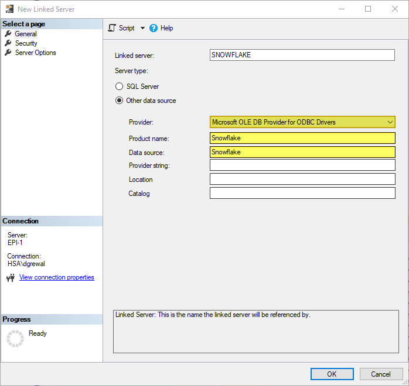

# Using OAUTH with Tokens to Connect to Snowflake via ODBC
Deep Grewal <br/>
dgrewal@schsa.org <br/>
Stanislaus County <br/>
January 27, 2023
***

## Overview
The Snowflake data repositories can be secured in multiple ways to protect information and limit access.  One common and standard method of connectivity that is utilized by many systems is Open Database Connectivity (ODBC).  ODBC allows for multiple applications, services, and tools to connect to a database using an ODBC entry that has been created on a machine with a Microsoft Windows operating system.  This method of connectivity can become complicated when OAUTH methods are used, especially with tokens that are set to expire.  

This document will provide some instructions on how you can setup a Windows system to connect to Snowflake repositories using OAUTH and expiring tokens.  The code presented in this document should be placed into a Windows Service, Scheduled Task, or SQL Server Agent Job to ensure that it executes and generates a new token prior to the expiration of the existing token.  New tokens can be generated at any time and should be generated with a buffer of time before the expiration of the existing token.

<br/>

## Step #1 Download and Install the ODBC Driver
Snowflake provides for the download of their ODBC driver.  The latest version of this driver can be obtained from their website by clicking on this [link](https://sfc-repo.snowflakecomputing.com/odbc/win64/latest/index.html).  Once downloaded, the driver can be installed using the installation wizard.

<br/>

## Step #2 Create a New System Data Source Name (DSN)
Create a new ODBC entry by clicking the "Start" button, typing in the word `run` and pressing `Enter`.  In the "Run" window, type `odbcad32.exe` and press `Enter` to launch the "ODBC Data Source Administrator".  Then, click on the "System DSN" tab and click the "Add..." button.

A new System DSN ODBC entry has been created using the newly installed Snowflake ODBC driver from the previous step.  The driver appears as "SnowflakeDSIIDriver" within the Windows "ODBC Data Source Administrator".  

 


The ODBC entry is named "Snowflake" and is configured as shown below.  For your own implentation, provide the proper values for the following fields: "Server", "Database", "Schema", "Warehouse", and "Role".  The value for "Tracing" has been set to "0" to minimize logging and verbosity while maximizing performance.  Also, note that the value for "Authenticator" has been set to "oauth".  

 

<br/>

## Step #3 Modify the Windows System Registry 
The Windows System Registry stores the System DSN along with its configuration parameters.  Modify the Windows System Registry entry for the ODBC entry created in the previous step by clicking the "Start" button, typing in the word `run` and pressing `Enter`.  In the "Run" window, type `regedit.exe` and press `Enter` to launch the "Registry Editor".

Navigate to the entry for the newly created ODBC entry using the following path: `Computer\HKEY_LOCAL_MACHINE\SOFTWARE\ODBC\ODBC.INI\Snowflake`.  Then, right-click to launch the context menu and select "New" > "String Value".  Name the new value "token" and press `Enter`.  


<br/>

## Step #4 Obtain a Token and Write it to the Windows System Registry
The code excerpts below can be written in various programming languages.  For the purposes of this guide, Visual Basic has been chosen as the programming language.  As aforementioned, the code should be placed into a Windows Service, Scheduled Task, or SQL Server Agent Job to ensure that it executes and generates a new token prior to the expiration of the existing token.

### Creating a Token Class
Within this code base, the token is going to be treated as an object that is instantiated from an existing class designated for the token.  The code below represents the creation of the token class.

```vb
Public Class AzureToken

    Public Property token_type As String
    Public Property scope As String
    Public Property expires_in As Integer
    Public Property ext_expires_in As Integer
    Public Property access_token As String

End Class
```

### Importing Needed Libraries
In order to generate a token, the following imports will facilitate the `GenerateToken()` function presented in the next section of this step.

```vb
Imports System.Net.Http
Imports System.Text.Json
```

### Generating a New Token
The code snippet below presents a framework for generating a new token.  There are many variable values which will differ based on your own implementaton.    
```vb
    Private Function GenerateToken() As String

        Dim tkn As New AzureToken()
        Dim httpClient As New HttpClient()

        Try
            Using httpClient
                Dim strURL As String = "https://login.microsoftonline.com/1a234b56-c7d8-9012-3efa-45b6cd7890e1/oauth2/v2.0/token"
                Dim lstValues As New List(Of KeyValuePair(Of String, String))
                With lstValues
                    .Add(New KeyValuePair(Of String, String)("client_id", "1234a456-bc7d-8efa-90a1-23b45cd67890"))
                    .Add(New KeyValuePair(Of String, String)("client_secret", "a12.bC3dEfghijkl_mn4O-p~567q78-rsT"))
                    .Add(New KeyValuePair(Of String, String)("grant_type", "password"))
                    .Add(New KeyValuePair(Of String, String)("username", "Your_Provided_Email_Address@cdph.onmicrosoft.com"))
                    .Add(New KeyValuePair(Of String, String)("password", "1@2A^bc$<D_3{.EF]g4H"))
                    .Add(New KeyValuePair(Of String, String)("scope", "https://1ab23456-789c-0def-1234-56a78901b234/session:role-any"))
                End With
                Dim fuecContent As New FormUrlEncodedContent(lstValues)
                Dim httpResponse As HttpResponseMessage = httpClient.PostAsync(strURL, fuecContent).Result
                Dim strResponse As String = httpResponse.Content.ReadAsStringAsync().Result
                tkn = JsonSerializer.Deserialize(Of AzureToken)(strResponse)
            End Using
            If tkn IsNot Nothing And tkn.access_token IsNot Nothing Then
                GenerateToken = System.Web.HttpUtility.UrlEncode(tkn.access_token)
            Else
                GenerateToken = ""
            End If
        Catch ex As Exception
            Dim strException As String = ex.Message
        Finally
            tkn = Nothing
        End Try

    End Function
```

> ***Note: Provide your own URLs and values in the Key-Value Pairs to generate a token that is specific for your project.***

`...`<br/>
`Dim strURL as String = "https://login.microsoftonline.com/{tenant}/oauth2/v2.0/token`<br/>
`...`<br/>
     `.Add(New KeyValuePair(Of String, String)("client_id", "{clientId}"))`<br/>
     `.Add(New KeyValuePair(Of String, String)("client_secret", "{secret}))`<br/>
     `...`<br/>
     `.Add(New KeyValuePair(Of String, String)("username", "{emailAddress}"))`<br/>
     `.Add(New KeyValuePair(Of String, String)("password", "{password}"))`<br/>
     `.Add(New KeyValuePair(Of String, String)("scope", "https://{scope}/session:role-any"))`<br/>
`...`<br/>

### Reading an Existing Token Value from Windows System Registry
Reading an existing token value from the System Registry is useful functionality and should be considered in the design of your code base.  It allows for a check/confirmation of a write to the System Registry.

```vb
    Private Function ReadTokenFromRegistry() As String

        Try
            'The word "Snowflake" is the name of the ODBC entry and is used in the registry path below.
            Dim strToken As String = My.Computer.Registry.GetValue("HKEY_LOCAL_MACHINE\SOFTWARE\ODBC\ODBC.INI\Snowflake", "token", Nothing)
            ReadTokenFromRegistry = IIf(strToken Is Nothing, "", strToken)
        Catch ex As Exception
            Dim strException As String = ex.Message
        End Try

    End Function
```

### Writing a New Token Value to the Windows System Registry
Each token contains an `expires_in` value which indicates when the token will expire (in seconds).  A new token should be generated and written to the System Registry well before the expiration will occur.

```vb
    Private Function WriteTokenToRegistry(ByVal strToken As String) As Boolean

        Dim blnError As Boolean
        Dim strCheckToken As String

        Try
            'The word "Snowflake" is the name of the ODBC entry and is used in the registry path below.
            My.Computer.Registry.SetValue("HKEY_LOCAL_MACHINE\SOFTWARE\ODBC\ODBC.INI\Snowflake", "token", strToken)
            strCheckToken = ReadTokenFromRegistry()
        Catch ex As Exception
            blnError = True
            Dim strException As String = ex.Message
        Finally
            WriteTokenToRegistry = Not (blnError) And (strToken = strCheckToken)
        End Try

    End Function    
```

The code excerpts above are the essentials of what is needed to generate a new token, read from the System Registry, and write to the System Registry.  This code should be modified and augmented to fit your own use case and implementation.  For example, in a Windows Service code base, a looping mechanism will be needed along with other Windows Service constructs and the Windows Service framework for managing the service.

## Step #5 Testing 

### Using Microsoft Excel
Microsoft Excel is pehaps the simplest and most ubiquitous application that can be used to ensure that the ODBC entry created in the previous steps with a refreshing token is actually functional.

In the Excel Menu/Ribbon, choose "Data" > "Get Data" > "From Other Sources" > "From ODBC".  In the dialog box, use the drop-down to find and select the "Snowflake" DSN or the name of the DSN created in Step #2.  Click the "OK" button.


If all steps were performed correctly, the "Navigator" window within Excel should populate with a tree-view of Snowflake database objects.


### Using SQL Server
One of the greatest benefits of having an ODBC entry for Snowflake is the ability to create a linked server within SQL Server.  In order to create a linked server, some settings should be configured.

#### Configure the MSOLEDBSQL Provider
Within SQL Server Management Studio, use the "Object Explorer" to navigate to "Server Objects" > "Linked Servers" > "Providers" and expand the "Providers" node.  Right-click the "MSOLEDBSQL" provider and select "Properties" from the context menu.

Within the "Provider options" pane, ensure that the checkboxes are checked for the following settings: "Nested queries", "Level zero only", "Allow inprocess", and "Supports 'Like' Operator".  Click the "OK" button.


#### Create a Linked Server
Next, create a new linked server by right-clicking on the "Linked Servers" node with the "Object Explorer" and select "New Linked Server..." from the context menu.

In the "New Linked Server" window, provide a name for the linked server in the "Linked server" field.  Choose "Microsoft OLE DB Provider for ODBC" for the "Provider" drop-down field.  Enter "Snowflake" DSN or the name of the DSN created in Step #2 for the "Product name" and "Data source" fields.

In the navigation pane on the left of this window, the "Security" option should be selected and configured according to your desired settings.  Click "OK" to complete the creation of the linked server.




A linked server should now appear in the "Object Explorer" and provide access to Snowflake database objects.


